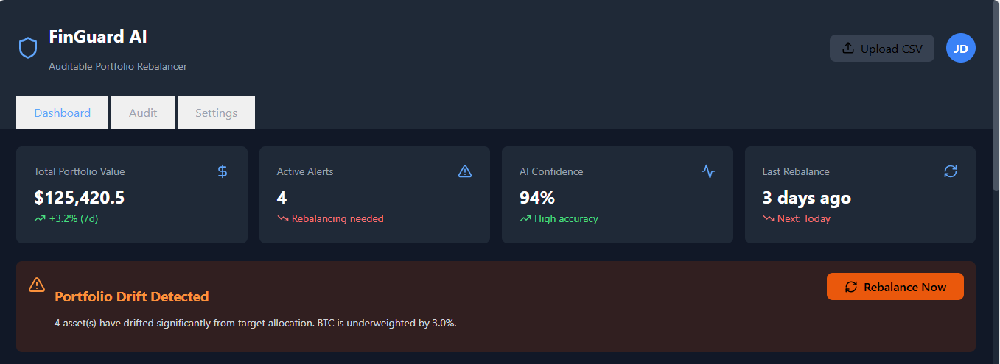
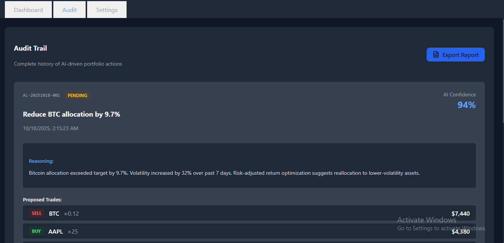
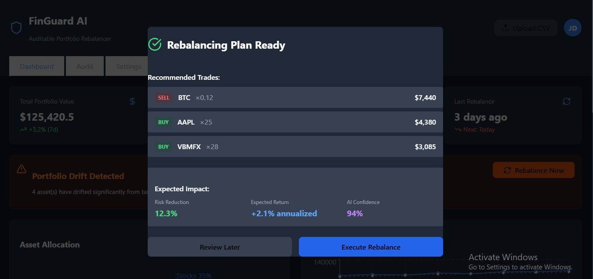

# 🛡️ FinGuard AI - Auditable Portfolio Rebalancer

> An AI-powered SaaS platform that automatically tracks investment portfolios, recommends rebalancing actions, and provides transparent, auditable explanations for every decision.


---

🌟 Features

- 🤖 AI-Powered Rebalancing - Intelligent portfolio analysis using Claude/GPT-4
- 📊 Real-Time Monitoring - Track stocks, crypto, bonds, and ETFs live
- 🔍 Drift Detection - Automatic alerts when allocation deviates from targets
- 📜 Blockchain-Style Audit Trail - Immutable, verifiable decision history
- 📈 Advanced Analytics - Sharpe ratio, VaR, risk metrics, and performance charts
- 🎯 Explainable AI - Every recommendation comes with clear reasoning
- 💳 SaaS Ready - Stripe integration for subscription billing

---

🖼️ Screenshots

Dashboard View


Audit Trail


Rebalancing Recommendations


---

🏗️ Tech Stack

| Layer | Technology | Purpose |
|-------|-----------|---------|
| Frontend | React 18 + Tailwind CSS | Interactive portfolio dashboard |
| Backend | FastAPI + Python 3.11 | High-performance API server |
| Database | PostgreSQL 15 | User data & audit logs |
| Cache | Redis 7 | Real-time data caching |
| AI/ML | LangChain + Claude/GPT-4 | Intelligent decision making |
| Charts | Recharts | Data visualization |
| Icons | Lucide React | Modern icon system |
| Deployment | Docker + Docker Compose | Containerized deployment |

---

🚀 Quick Start

Prerequisites

- Node.js 18+ and npm
- Python 3.11+
- Git

Installation

1. Clone the repository
```bash
git clone https://github.com/YOUR_USERNAME/finguard-ai.git
cd finguard-ai
```

2. Set up Frontend
```bash
cd frontend/frontend
npm install
npm start
```

The app will open at `http://localhost:3000`

3. Set up Backend (Optional - for full functionality)
```bash
cd backend
python -m venv venv
source venv/bin/activate  # On Windows: venv\Scripts\activate
pip install -r requirements.txt
uvicorn main:app --reload
```

Backend API will run at `http://localhost:8000`

---

📁 Project Structure
```
finguard-ai/
├── frontend/
│   └── frontend/
│       ├── src/
│       │   ├── App.js              # Main dashboard component
│       │   ├── index.css           # Tailwind CSS imports
│       │   └── FinGuard.css        # Custom styles (if needed)
│       ├── public/
│       ├── package.json
│       └── tailwind.config.js
│
├── backend/
│   ├── main.py                     # FastAPI application
│   ├── ai_agent.py                 # AI/ML logic
│   ├── database.py                 # Database models
│   ├── requirements.txt            # Python dependencies
│   └── .env.example               # Environment variables template
│
├── docs/
│   ├── API_DOCS.md
│   ├── ARCHITECTURE.md
│   └── screenshots/
│
├── tests/
│   ├── test_analyzer.py
│   ├── test_api.py
│   └── test_audit_trail.py
│
├── .gitignore
├── docker-compose.yml
├── README.md
└── LICENSE
```

---

🎮 Usage

Creating a Portfolio

1. Click "Upload CSV" or manually add holdings
2. Set target allocations for each asset category
3. The AI will automatically monitor for drift

Getting Rebalancing Recommendations

1. Click "Rebalance Now" when alerts appear
2. Review AI-generated trades and reasoning
3. Execute or save recommendations for later

Viewing Audit Trail

1. Navigate to the "Audit" tab
2. See complete history of all AI decisions
3. Export reports for compliance/tax purposes

---

🔧 Configuration

Frontend Configuration

`frontend/frontend/.env` 
```env
REACT_APP_API_URL=http://localhost:8000
REACT_APP_ENABLE_MOCK_DATA=true
```


---

📊 Features in Detail

Dashboard
- Total Portfolio Value with 7-day performance
- Active Alerts for drift detection
- AI Confidence Score for recommendations
- Asset Allocation pie chart
- Performance Tracking line chart
- Holdings Table with live prices

Audit Trail
- Complete history of AI decisions
- Reasoning for each recommendation
- Trade details with confidence scores
- Risk reduction metrics
- Verifiable hash chain

Settings
- Adjustable target allocations
- Auto-rebalancing preferences
- Notification settings
- Tax-loss harvesting options

---

🧪 Testing
```bash
# Frontend tests
cd frontend/frontend
npm test

# Backend tests (when implemented)
cd backend
pytest tests/ -v
```

---

📈 Roadmap

Phase 1 - MVP (Current)
- [x] Portfolio tracking
- [x] AI-powered rebalancing recommendations
- [x] Audit trail system
- [x] Interactive dashboard

Phase 2 - Enhanced Features
- [ ] User authentication (JWT)
- [ ] Database integration (PostgreSQL)
- [ ] Real-time market data APIs
- [ ] Email notifications
- [ ] CSV import/export

Phase 3 - Advanced Features
- [ ] Stripe payment integration
- [ ] Tax-loss harvesting
- [ ] Mobile app (React Native)
- [ ] Multi-currency support
- [ ] Social trading features

Phase 4 - Enterprise
- [ ] White-label solution
- [ ] API for third-party integration
- [ ] Advanced risk analytics
- [ ] Institutional features

---

🤝 Contributing

Contributions are welcome! Please follow these steps:

1. Fork the repository
2. Create a feature branch (`git checkout -b feature/amazing-feature`)
3. Commit your changes (`git commit -m 'Add amazing feature'`)
4. Push to the branch (`git push origin feature/amazing-feature`)
5. Open a Pull Request

Development Guidelines

- Follow React best practices
- Use Tailwind CSS for styling
- Write meaningful commit messages
- Add tests for new features
- Update documentation

---

🐛 Known Issues

- Backend API endpoints are currently mocked
- Database persistence not yet implemented
- Real-time market data requires API keys
- Mobile responsiveness needs improvement

---

📄 License

This project is licensed under the MIT License - see the [LICENSE](LICENSE) file for details.

---

👤 Author

Shreyas Bhalekar
- GitHub: [Shreyasbhalekar18](https://github.com/Shreyasbhalekar18)
- Email: shreyasbhalekatr156@apsit.edu.in

---

🙏 Acknowledgments

- Anthropic Claude- AI reasoning engine
- OpenAI - GPT-4 integration
- Recharts - Beautiful data visualization
- Lucide - Modern icon library
- Tailwind CSS- Utility-first CSS framework

---

📞 Support


---

## ⭐ Star History

If you find this project useful, please consider giving it a star!

[](https://star-history.com/#YOUR_USERNAME/finguard-ai&Date)

---


Making AI-driven finance transparent, auditable, and trustworthy.